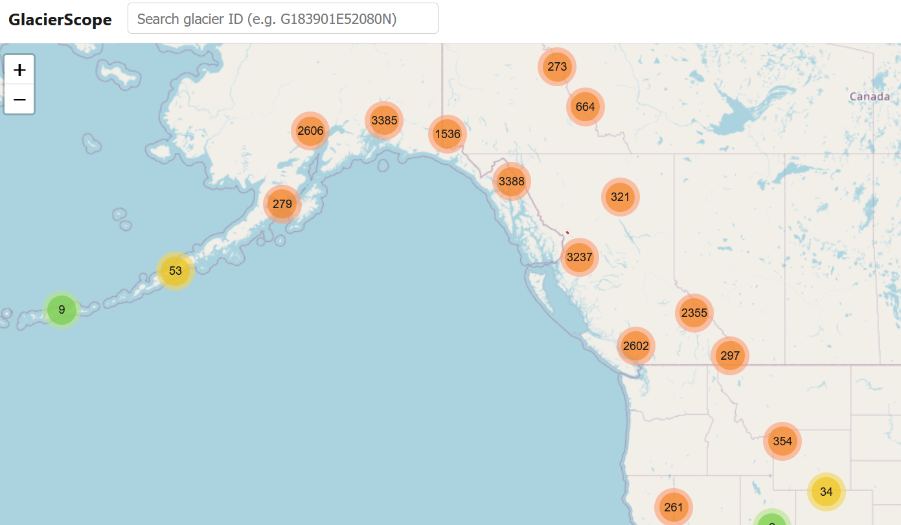
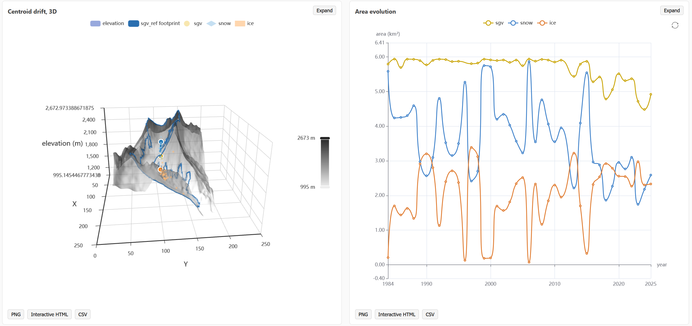
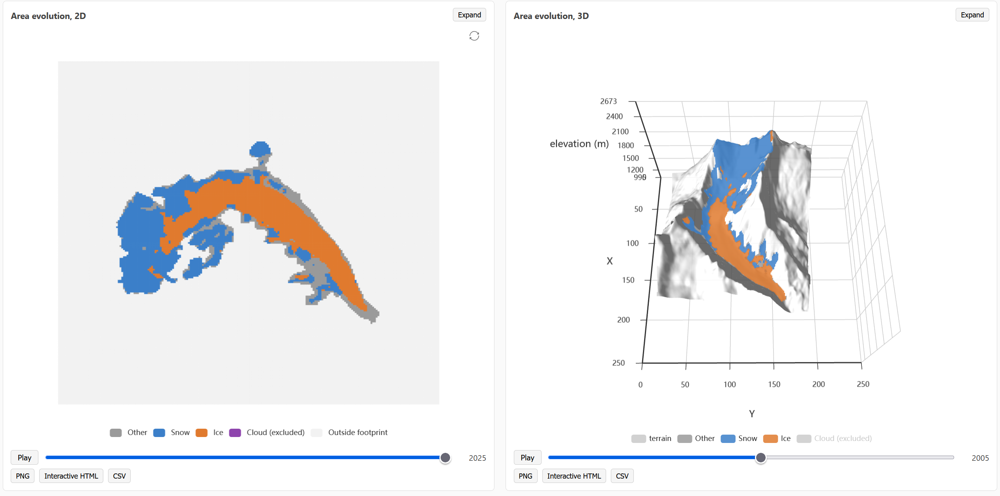
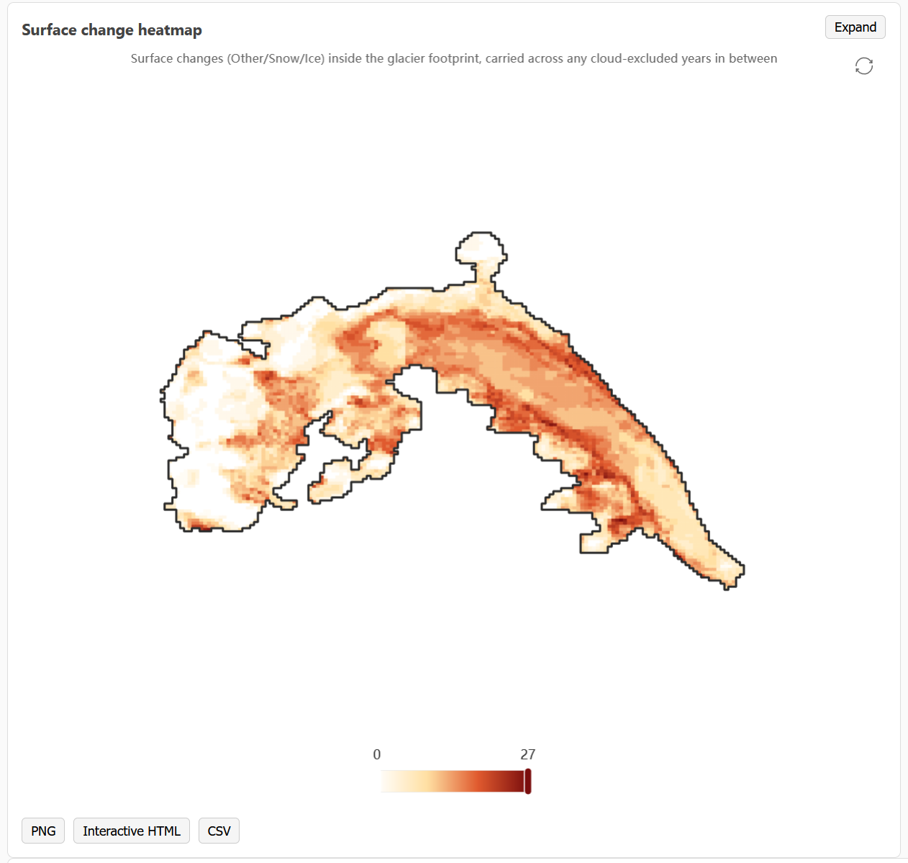
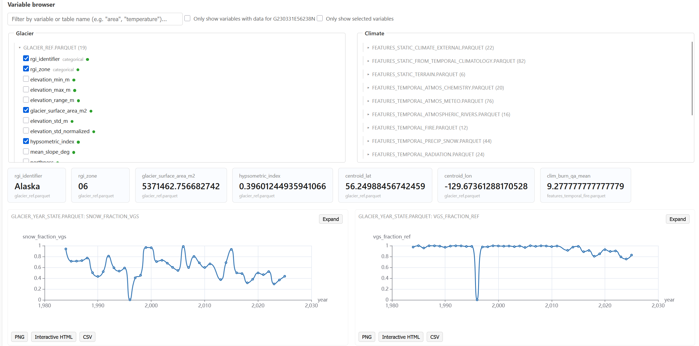

# GlacierScope

Browse per-glacier snow/ice state, centroid drift, and area change across
the full dataset: world map, search by glacier ID, per-glacier plots.

<p align="center">
  
</p>
<p align="center">
  
  
</p>
<p align="center">
  
  
</p>

## Data source

GlacierScope is a viewer for the **Western North America Glacier
Segmentation and Snow-Fraction Record**: a 42-year (1984-2025), five-sensor
end-of-season snow-fraction record for 22,168 glaciers across Alaska,
Western Canada, and the contiguous Western USA, produced by U-Net
segmentation of satellite imagery.

- **Data (Zenodo deposit)**: [10.5281/zenodo.22311127](https://doi.org/10.5281/zenodo.22311127)
- **Code that produced it**: [Research-Tarka/glacier-fsnow-unet](https://github.com/Research-Tarka/glacier-fsnow-unet)
- **Paper**: Tarka, Maxime and Baraër, Michel and Aubry-Wake, Caroline,
  *Benchmarked and leakage-validated deep-learning glacier segmentation: a
  42-year, five-sensor snow-fraction record for western North America*
  (September 21, 2026). Available at SSRN:
  [https://ssrn.com/abstract=7418104](https://papers.ssrn.com/sol3/papers.cfm?abstract_id=7418104)
  or http://dx.doi.org/10.2139/ssrn.7418104

The Zenodo deposit contains the full archive (trained models, training
data, benchmark/robustness analyses, etc.); GlacierScope only needs two
parts of it, picked in the file picker on first run:

- `Glacier_Evolution/` -- `glacier_evolution_full.gpkg` (annual footprint
  polygons + 3D centroids for six feature types) and `DEM_tiles/`
  (per-glacier 30 m DEM). Required.
- `Analysis_Inputs/` -- `Static/glacier_ref.parquet`,
  `Temporal/glacier_year_state.parquet`,
  `Temporal/stats_normalized.parquet`, and anything under `Covariates/`.
  Optional parquet/csv tables to browse alongside the map; any number of
  them can be added, from this folder or elsewhere.

See `Glacier_Evolution/README.md` and `Analysis_Inputs/Covariates/README.md`
inside the deposit for field-level documentation of each file.

Fully standalone: no Python install, no conda environment, and no other
software required on the end user's machine. Every Python dependency
(duckdb, polars, orjson, pyproj, rasterio, shapely, numpy, scipy) ships
pre-installed inside `viewer/runtime/python`, the bundled embeddable Python
distribution `GlacierScope.bat` runs. Double-clicking the `.bat` is the
entire setup.

**Two ways to get it**, depending on what you're doing:

- **Just want to use it**: download the zip from the
  [Releases](../../releases) page and unzip it -- it already has every
  dependency installed inside `viewer/runtime/python`, so `GlacierScope.bat`
  works immediately, offline, no Python of any kind on your machine.
- **Building from source (`git clone`)**: the repo itself does not (and
  cannot) track `viewer/runtime/python/Lib/site-packages` -- installed
  packages run ~650 MB, far too large for git. `GlacierScope.bat` detects
  a source checkout automatically and pip-installs everything from
  `viewer/runtime/requirements.txt` into the bundled runtime the first time
  it runs (needs an internet connection for that one-time step; every run
  after is fully offline, same as the Release zip).

## Layout

```
GlacierScope.bat        Windows launcher: file picker, then builds the cache and starts the viewer.
ingest/                 Python, builds viewer/data/ from picked files.
viewer/                 Plain JS. No build step, no backend logic beyond serving files.
viewer/serve.py         Static file server with caching disabled for data endpoints, plus a small
                          per-glacier data API and a proxied/disk-cached map tile endpoint.
viewer/runtime/python/  Bundled Python (embeddable, python.org) with the packages ingest.py and
                          serve.py need pip-installed into it (duckdb, polars, orjson, pyproj,
                          rasterio, shapely, numpy, scipy) -- this is the only Python GlacierScope
                          uses, nothing needs to be pre-installed on the machine.
viewer/data/            Generated by ingest/, not tracked in git.
```

## Running it

Nothing to install first. Double-click `GlacierScope.bat`.

The very first run downloads Tcl/Tk from python.org (~3.4 MB, ~11 MB once
unpacked, matching the bundled Python's exact version) into
`viewer/runtime/python`, so the file picker can start -- the embeddable
Python distribution ships without it. After that one-time fetch,
everything runs offline; subsequent runs skip it instantly. See
`viewer/runtime/fetch_tkinter.ps1` if you want to run that step manually
or ahead of time.

It then opens a picker:

1. Select `glacier_evolution_full.gpkg` and the `DEM_tiles` folder from
   `Glacier_Evolution/` in the [Zenodo deposit](https://doi.org/10.5281/zenodo.22311127).
2. Add any number of parquet/csv tables to include -- typically
   `Analysis_Inputs/Static/glacier_ref.parquet`,
   `Analysis_Inputs/Temporal/glacier_year_state.parquet`,
   `Analysis_Inputs/Temporal/stats_normalized.parquet`, and any covariate
   tables under `Analysis_Inputs/Covariates/` -- but nothing has to come
   from a specific folder or deposit. The picker remembers the last
   selection and pre-fills it, so most of the time this step is just
   "Start".
3. Click "Start". It builds `viewer/data`, then opens the viewer in the
   browser automatically.

Closing the console window it opens stops the server.

If you already have `viewer/data` built and just want to view it again
without touching the picker, run the viewer directly instead:

```
cd viewer
runtime\python\python.exe serve.py 8000
```

Open `http://localhost:8000`. A bare `file://` open will not work --
loading `viewer/data/*` needs an actual HTTP server.

If a browser tab was already open from a previous run and looks
unchanged after rebuilding the cache, reload it (F5) -- the server sends
`Cache-Control: no-store`, but an already-open tab keeps whatever it
loaded until it's told to fetch again.

## Performance and memory

Per-glacier data (DEM, classification stack, change heatmap, altitude
evolution) is computed once per glacier and cached to disk under
`viewer/data/.raster_cache_v2/`, keyed by glacier ID. A server restart does not
recompute this for a glacier already visited before; a rebuild of
`viewer/data` (new `glacier_evolution_full.gpkg`/`DEM_tiles` or table selection) starts from an
empty cache, since the source data changed.

The client fetches all per-glacier resources (DEM, geometry, classification
stack, variables, heatmap, altitude evolution) in parallel on selection
instead of one after another, and binary responses (`dem.bin`,
`sgv_stack.bin`) are gzip-compressed in transit.

Connected-component and TSL-proxy computation for the altitude evolution
chart runs server-side (`scipy.ndimage.label`, vectorized) instead of in the
browser, and is cached alongside the rest of the per-glacier data.

Reference footprint lookups for the world map (used when panning/zooming)
are indexed by a coarse 1x1 degree grid instead of scanning every glacier on
each request.

Source tables (glacier_year_state, covariates, etc.) are never loaded whole
into memory. Each request for a glacier's meta/year_series data scans the
relevant parquet file with the `id_glims` filter pushed into the read
itself (Polars `scan_parquet`), so RAM stays proportional to glaciers
actually clicked rather than to the size of the source tables on disk --
loading one glacier's rows out of a table with hundreds of thousands of
rows costs well under a megabyte, however many such tables are selected at
ingest time. Server startup only prepares what the world map itself needs
(the glacier_evolution spatial index and every glacier's simplified sgv_ref
outline) -- it does not pre-load any source table.

## Figures and data export

Every pre-built figure (reference footprint, centroid drift, area/fraction/
altitude evolution, surface change heatmap) has PNG, interactive HTML, and
CSV export buttons. The CSV for each figure is shaped around its actual
source variables (e.g. `feature_type, year, area_m2` for area evolution;
`row, col, change_count, cloud_excluded_years` for the change heatmap)
rather than the chart's internal series layout. CSV export for the 2D/3D
per-pixel classification stacks is computed lazily, only when the CSV
button is clicked, since that table can be large (one row per year x row x
column) and building it up front on every glacier selection would undo the
point of loading everything else lazily.

The variable browser (bottom of a glacier's page: pick any column from any
ingested table) also has PNG/HTML/CSV export on every chart it renders, and
an "Only show selected variables" filter next to the existing "Only show
variables with data" one -- useful for finding and unchecking a few
variables out of a large active selection without hunting through every
table section again.

## Offline map tiles

The base map is served through `viewer/serve.py` at `/tiles/{z}/{x}/{y}.png`
instead of the client fetching OpenStreetMap directly. Each tile fetched
this way is cached to disk under `viewer/data/.tile_cache/`. Any area
already panned or zoomed into during a session with network access stays
available with no connection on a later run. There is no separate
bulk-download step; the cache fills in as areas are viewed.

## Development

`ingest/environment.yml` is a conda environment spec kept for local dev/CI
convenience (matching package versions in an editor-friendly env) -- it is
not needed to run GlacierScope itself, which is fully self-contained via
`viewer/runtime/python`.

Adding a new Python dependency to `ingest.py` or `serve.py` means installing
it into the bundled runtime as well, not just `environment.yml`:

```
viewer\runtime\python\python.exe -m pip install <package>
```

Otherwise `GlacierScope.bat` (which always runs against the bundled
runtime, never conda) fails with `ModuleNotFoundError` even though the
package is present in a dev conda env.

## Citation

If you use the underlying dataset, please cite the paper and the Zenodo
deposit:

> Tarka, Maxime and Baraër, Michel and Aubry-Wake, Caroline, Benchmarked and
> leakage-validated deep-learning glacier segmentation: a 42-year, five-sensor
> snow-fraction record for western North America (September 21, 2026).
> Available at SSRN: https://ssrn.com/abstract=7418104 or
> http://dx.doi.org/10.2139/ssrn.7418104

> https://doi.org/10.5281/zenodo.22311127

## License

MIT, see LICENSE.
